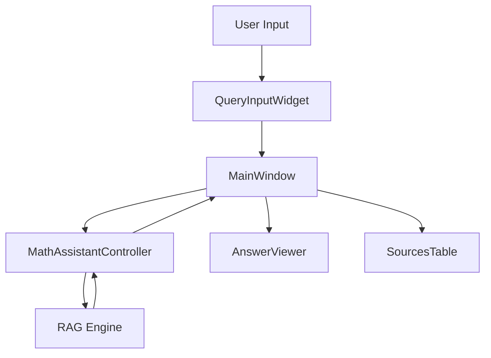

# 🎨 Améliorations GUI - Assistant Math RAG v3.1

## 📋 Vue d'ensemble

L'interface graphique a été complètement refactorisée avec une architecture MVC moderne, des widgets réutilisables et un style GitHub Dark cohérent.

## 🏗️ Architecture

```
src/ui/gui/
├── __init__.py          # Exports du module
├── app.py               # Application principale (MainWindow)
├── styles.py            # Styles Qt et templates HTML
└── widgets.py           # Widgets réutilisables
```

### Séparation des responsabilités

- **app.py** : Logique de l'application, gestion des événements
- **widgets.py** : Composants UI réutilisables
- **styles.py** : Styles globaux et templates
- **Controller** : Communication avec le backend RAG

## 🎨 Styles et Design

### Thème GitHub Dark

- Palette de couleurs cohérente inspirée de GitHub Dark
- Contraste optimisé pour la lisibilité
- Animations et transitions douces
- Support du mode sombre natif

### Composants stylisés

| Composant | Caractéristiques |
|-----------|------------------|
| Buttons | États hover/pressed, variantes (primary, danger) |
| Inputs | Focus states, placeholders stylisés |
| Tables | Alternance de lignes, sélection visible |
| Scrollbars | Design minimaliste, largeur réduite |
| Checkboxes | Style moderne avec indicateurs clairs |

## 🧩 Widgets Réutilisables

### 1. AnswerViewer
**Rôle** : Afficher les réponses avec support LaTeX (KaTeX)

**Fonctionnalités** :
- Support WebEngine (KaTeX) avec fallback TextBrowser
- Conversion Markdown → HTML
- Rendu LaTeX inline et display
- Styles cohérents avec le thème

**API** :
```python
viewer = AnswerViewer()
viewer.set_answer(markdown_text)
viewer.clear()
```

### 2. SourcesTable
**Rôle** : Afficher les sources utilisées

**Fonctionnalités** :
- 5 colonnes : #, Bloc, Chap/Sec, Page, Aperçu
- Tri automatique des colonnes
- Tooltips sur l'aperçu
- Sélection de lignes

**API** :
```python
table = SourcesTable()
table.populate(docs_list)
```

### 3. ScopeWidget
**Rôle** : Gérer la portée (scope) de recherche

**Fonctionnalités** :
- Champs : Chapitre, Block kind, Block id, Type
- Boutons Appliquer/Réinitialiser
- Signal `scope_changed(dict)` émis lors des changements

**API** :
```python
scope_widget = ScopeWidget()
scope_widget.scope_changed.connect(handler)
scope = scope_widget.get_scope()
```

### 4. OptionsWidget
**Rôle** : Options de recherche

**Fonctionnalités** :
- Auto-link (follow-up)
- Mode debug
- Tooltips explicatifs

**API** :
```python
options = OptionsWidget()
auto_link = options.is_auto_link_enabled()
debug = options.is_debug_enabled()
```

### 5. ActionsWidget
**Rôle** : Actions rapides

**Fonctionnalités** :
- 5 boutons : Pin, Unpin, New chat, Forget, Save log
- Signaux pour chaque action
- Icônes Unicode

**Signaux** :
- `pin_clicked()`
- `unpin_clicked()`
- `new_chat_clicked()`
- `forget_clicked()`
- `save_log_clicked()`

### 6. QueryInputWidget
**Rôle** : Saisie des questions

**Fonctionnalités** :
- Champ de question avec placeholder
- Filtre de type (dropdown)
- Bouton Envoyer stylisé
- Support Enter key
- Signal `query_submitted(str, str)`

**API** :
```python
query_input = QueryInputWidget()
query_input.query_submitted.connect(handler)
query_input.set_enabled(False)  # Pendant traitement
query_input.focus_input()
```

### 7. SectionLabel
**Rôle** : Labels de section stylisés

**Fonctionnalités** :
- Style uppercase
- Espacement cohérent
- Couleur atténuée

## 🔄 Flux de données



## 📱 Layout

### Structure de la fenêtre

```
┌─────────────────────────────────────────┐
│ Status Bar                              │
├──────────┬──────────────────────────────┤
│          │                              │
│ Sidebar  │  Answer Viewer               │
│          │                              │
│  - Scope │                              │
│  - Opts  ├──────────────────────────────┤
│  - Acts  │  Sources Table               │
│          │                              │
│          ├──────────────────────────────┤
│          │  Query Input                 │
└──────────┴──────────────────────────────┘
```

### Sidebar (330px fixe)

1. **Titre** : "Assistant Math RAG"
2. **Portée** : ScopeWidget
3. **Options** : OptionsWidget
4. **Actions** : ActionsWidget
5. **Version** : v3.1

### Centre (flexible)

1. **Answer Viewer** (60% hauteur)
2. **Sources Table** (30% hauteur)
3. **Query Input** (10% hauteur)

## 🎯 Améliorations par rapport à l'ancien code

### 1. Architecture
- ✅ Séparation MVC claire
- ✅ Widgets réutilisables
- ✅ Styles externalisés
- ✅ Contrôleur dédié

### 2. UI/UX
- ✅ Thème cohérent GitHub Dark
- ✅ Meilleure lisibilité
- ✅ Feedback visuel amélioré
- ✅ Tooltips informatifs
- ✅ États hover/focus/pressed

### 3. Code Quality
- ✅ Type hints partout
- ✅ Docstrings complètes
- ✅ Noms de variables clairs
- ✅ Pas de code dupliqué
- ✅ Gestion d'erreurs robuste

### 4. Fonctionnalités
- ✅ Support WebEngine + fallback
- ✅ Conversion Markdown améliorée
- ✅ Gestion de scope simplifiée
- ✅ Actions rapides accessibles
- ✅ Debug mode intégré

## 🚀 Utilisation

### Lancement

```bash
# Via script
python scripts/run_gui.py

# Via Makefile
make gui

# Direct
python -m src.ui.gui.app
```

### Workflow typique

1. **Définir la portée** (optionnel)
   - Remplir les champs du ScopeWidget
   - Cliquer "Appliquer"

2. **Configurer les options**
   - Cocher Auto-link pour follow-up
   - Cocher Debug pour voir les détails

3. **Poser une question**
   - Taper dans le champ
   - Sélectionner un filtre (optionnel)
   - Cliquer Envoyer ou Enter

4. **Consulter la réponse**
   - Réponse affichée avec LaTeX
   - Sources détaillées en dessous

5. **Actions avancées**
   - Pin : Épingler le contexte
   - New chat : Nouveau contexte isolé
   - Save log : Exporter l'historique

## 🔧 Configuration

### Variables d'environnement

```bash
# GUI
MATH_GUI_WIDTH=1200
MATH_GUI_HEIGHT=800
MATH_GUI_SIDEBAR_WIDTH=330
MATH_GUI_DARK_THEME=1
```

### Config Python

```python
from src.core.config import ui_config

ui_config.gui_width = 1400
ui_config.gui_sidebar_width = 350
ui_config.gui_dark_theme = True
```

## 🐛 Debugging

### Mode Debug

Activer via :
- Checkbox dans OptionsWidget
- Variable d'environnement : `MATH_DEBUG=1`

Affiche :
- Requête réécrite
- Requête avec hints
- Kwargs finaux
- Temps de traitement

### Logs

```bash
# Emplacement par défaut
./logs/

# Personnaliser
export MATH_LOG_DIR=/path/to/logs
```

## 📦 Dépendances

```toml
[project]
dependencies = [
    "PySide6>=6.6.0",
    "PySide6-WebEngine>=6.6.0",  # Pour KaTeX
]
```

### Fallback sans WebEngine

Si `PySide6-WebEngine` n'est pas installé, l'application utilise automatiquement `QTextBrowser` (sans rendu LaTeX).

## 🎨 Personnalisation des styles

### Modifier les couleurs

Éditer `src/ui/gui/styles.py` :

```python
# Couleurs principales
BG_PRIMARY = "#0d1117"
BG_SECONDARY = "#161b22"
BORDER_COLOR = "#30363d"
TEXT_COLOR = "#e6edf3"
ACCENT_COLOR = "#1f6feb"
```

### Ajouter un widget stylisé

```python
class MyWidget(QtWidgets.QWidget):
    def __init__(self, parent=None):
        super().__init__(parent)
        self.setObjectName("my_widget")
```

Puis dans `GLOBAL_STYLE` :

```css
QWidget#my_widget {
    background-color: #161b22;
    border: 1px solid #30363d;
}
```

## 🔮 Améliorations futures

- [ ] Thème clair/sombre commutable
- [ ] Raccourcis clavier (Ctrl+N, Ctrl+S, etc.)
- [ ] Historique des conversations
- [ ] Export PDF des réponses
- [ ] Mode plein écran
- [ ] Zoom sur les formules LaTeX
- [ ] Syntaxe highlighting dans les code blocks
- [ ] Auto-save des sessions

## 📚 Ressources

- [PySide6 Documentation](https://doc.qt.io/qtforpython-6/)
- [KaTeX Documentation](https://katex.org/docs/api.html)
- [GitHub Primer Design System](https://primer.style/)

## ✅ Checklist de migration

Si tu migres de l'ancien `math_assistant_gui.py` :

- [x] Copier les fichiers `app.py`, `styles.py`, `widgets.py`
- [x] Créer `__init__.py`
- [x] Mettre à jour `scripts/run_gui.py`
- [x] Tester l'initialisation RAG
- [x] Vérifier le rendu LaTeX
- [x] Tester toutes les actions (pin, unpin, etc.)
- [x] Valider les styles sur ton écran
- [x] Vérifier la gestion d'erreurs
- [x] Tester le mode debug
- [x] Valider l'export de logs

---

**Dernière mise à jour** : 2025-01-30  
**Version** : 3.1  
**Auteur** : Claude (Anthropic)